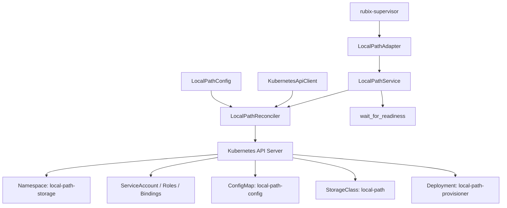

# Local-Path Storage Reconciliation and Optional Deployment

This document describes the reconciliation, lifecycle management, optional deployment, and supervisor integration for the KubeSolo local-path persistent storage provisioner (`rubix-storage`).

## Overview

The `rubix-storage` subsystem provides host-backed persistent storage using the Rancher local-path provisioner (`rancher.io/local-path`). It is designed to operate safely as an optional cluster addon:
1. **Disabled Mode**: When disabled (`enabled = false`), zero Kubernetes resources are reconciled or created, and container runtime image imports for provisioner assets are omitted. The supervisor adapter marks the component ready immediately without spawning background tasks.
2. **Idempotent Reconciliation**: Repeat startup converges on canonical manifests without disrupting active workloads. Merged `ConfigMap` resources preserve custom user keys and operator metadata labels.
3. **Supervisor Degradation Policy (`FailurePolicy::Degrade`)**: Injected optional provisioner failures or readiness timeouts transition the component to a degraded state while leaving the core Kubernetes API and control plane fully operational and healthy.

---

## Architecture and Components



### Reconciliation Workflow (`LocalPathReconciler`)

1. **Namespace Verification**: Checks for `local-path-storage`; creates if absent.
2. **RBAC Reconciliation**:
   - `ServiceAccount`: `local-path-provisioner-service-account`
   - `Role`: `local-path-provisioner-role` (namespaced pod access)
   - `RoleBinding`: `local-path-provisioner-bind`
   - `ClusterRole`: `local-path-provisioner-role` (cluster-wide PVC/PV/node/storageclass access)
   - `ClusterRoleBinding`: `local-path-provisioner-bind`
3. **ConfigMap Merge-Patch**:
   - Fetches existing `local-path-config`.
   - Preserves custom annotations, custom labels, and user-defined data keys (e.g. custom policies or overrides).
   - Updates canonical keys (`config.json`, `setup`, `teardown`, `helperPod.yaml`).
4. **StorageClass Reconciliation**:
   - Creates or updates default `local-path` `StorageClass` with `volumeBindingMode: WaitForFirstConsumer` and `reclaimPolicy: Retain`.
5. **Deployment Reconciliation**:
   - Creates or updates `local-path-provisioner` deployment with pinned images and memory/CPU limits.

---

## Optional Provisioner Deployment and Image Selection

Storage provisioner deployment adapts dynamically to configuration:
- **Provisioner Image**: Defaults to `docker.io/rancher/local-path-provisioner:v0.0.36`. Can be overridden with private/offline registry targets.
- **Helper Image**: Defaults to `busybox` embedded in `helperPod.yaml`.
- **Storage Paths**: Supports local filesystem directory mapping (`nodePathMap`) or shared cluster volume paths (`sharedFileSystemPath`).

---

## Degradation and Fault Tolerance

Storage provisioner components run under `rubix-supervisor` using `FailurePolicy::Degrade`:
- If an injected failure occurs or deployment readiness times out, the supervisor reports:
  ```rust
  FailureKind::Adapter("storage-injected-failure") // or "storage-readiness-timeout"
  ```
- The `LifecycleSnapshot` records `degraded = true`.
- The core API server, datastore, DNS, and control-plane components remain untouched and 100% operational.
- Workloads not dependent on new volume provisioning continue running uninterrupted.
