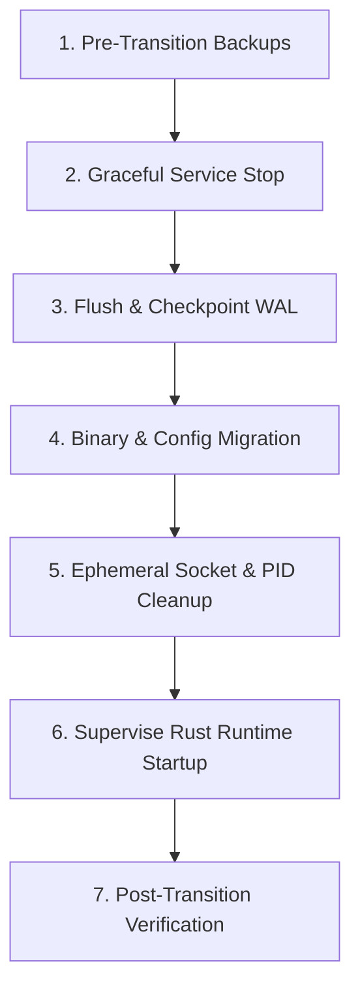

# Supported Go-to-Rust State Transition Paths

This document defines the supported starting versions, state domain migration contracts, operational prerequisites, downtime windows, and proof of datastore non-interchangeability for migrating existing Portainer KubeSolo single-node clusters to Rubix.

## 1. Supported Starting Versions & Migration Boundaries

Rubix supports migration from Portainer KubeSolo starting at version `v1.1.8` through `v1.3.3`. Earlier versions are explicitly rejected at preflight.

| Starting Version | Configuration Delivery | PKI Trust Roots | Datastore | Migration Requirement |
| --- | --- | --- | --- | --- |
| `v1.1.8` | CLI flags in systemd service unit | `/var/lib/kubesolo/pki` | Kine SQLite (`kine/db/state.db`) | Automatic CLI flag extraction to `/etc/kubesolo/config.yaml` (mode `0600`), service unit backup |
| `v1.2.0` | CLI flags in systemd service unit | `/var/lib/kubesolo/pki` | Kine SQLite (`kine/db/state.db`) | Automatic CLI flag extraction to `/etc/kubesolo/config.yaml` (mode `0600`), service unit backup |
| `v1.3.0` | YAML config file (`/etc/kubesolo/config.yaml`) | `/var/lib/kubesolo/pki` | Kine SQLite (`kine/db/state.db`) | Direct config preservation; service unit already points to `--config` |
| `v1.3.1` | YAML config file (`/etc/kubesolo/config.yaml`) | `/var/lib/kubesolo/pki` | Kine SQLite (`kine/db/state.db`) | Direct config preservation |
| `v1.3.2` | YAML config file (`/etc/kubesolo/config.yaml`) | `/var/lib/kubesolo/pki` | Kine SQLite (`kine/db/state.db`) | Direct config preservation |
| `v1.3.3` | YAML config file (`/etc/kubesolo/config.yaml`) | `/var/lib/kubesolo/pki` | Kine SQLite (`kine/db/state.db`) | Direct config preservation |

### Unsupported Boundaries & Preflight Rejections
- **Versions < `v1.1.8`** (e.g. `v1.0.0`, `v1.1.7`): Rejected immediately with `BelowMinimumSupported`. Legacy internal layouts prior to `v1.1.8` lack standardized Kine schema revisions and uniform PKI key layouts.
- **Malformed / Development Versions** (e.g. `develop`, empty string, `unversioned`): Rejected with `Malformed` or `Empty` error when performing production state transition.

## 2. State Domains & Preservation Guarantees

Transition assertions verify state integrity across five discrete domains:

### 2.1 Configuration
- **Legacy flags (< v1.3.0)**: Flags (`--node-ip`, `--cluster-cidr`, `--service-cidr`, `--dns-ip`, `--disable-ipv6`, `--portainer-edge-id`, `--portainer-edge-key`) are extracted from the systemd unit file (`kubesolo.service`). They are translated into a validated `/etc/kubesolo/config.yaml` written atomically with restrictive permissions (`0600`).
- **Backup creation**: The original service unit is backed up to `<service-path>.bak` prior to modification.
- **Config preservation (>= v1.3.0)**: If `/etc/kubesolo/config.yaml` already exists or the service specifies `--config`, the existing file is preserved byte-for-byte and not overwritten.

### 2.2 PKI Trust Roots & Client Credentials
- **Root CA**: The cluster CA certificate (`ca.crt`) and private key (`ca.key`) are preserved byte-for-byte, maintaining mutual TLS trust across all node components.
- **ServiceAccount Key**: The service account signing key (`service-account.key`) is preserved byte-for-byte, ensuring all existing Kubernetes ServiceAccount JWT tokens remain valid without needing pod restarts or token reissuance.
- **Kubeconfig Accommodation**: Both **YAML** and **JSON** serialized kubeconfig formats (e.g. in `/etc/kubesolo/admin.kubeconfig` or `/var/lib/kubesolo/pki/admin.kubeconfig`) are parsed and validated:
  - Cluster server endpoint must match `https://127.0.0.1:6443`.
  - Base64-encoded client certificates are cryptographically verified against the preserved root CA.

### 2.3 Datastore: Proof of Non-Interchangeability & Explicit Export/Import
- **No Automatic Interchangeability**: Rubix explicitly disproves the assumption that Kine SQLite files and Rubix datastore snapshots are interchangeable on-disk.
  - Feeding a raw Kine SQLite file (`state.db`) directly to `rubix-datastore` is rejected with an explicit fatal header error (magic header check failure: expected `RUBXSNP1`, found SQLite format 3 header).
- **Explicit Export/Import**: Transition requires explicit export of active key-value pairs from Kine into the canonical `rubix-datastore` format:
  - Active keys are extracted, excluding tombstones (`deleted = 1`).
  - Monotonic revision counters are preserved (max create/prev revision).
  - Snapshot file format: 8-byte magic header (`RUBXSNP1`) + 8-byte LE record count + sequential length-prefixed key/value payloads + accompanying `backup-meta.json`.
  - Verification: 100% of active keys and values are restored identically in the target datastore.

### 2.4 Static Workloads & Kubernetes Resource Identities
- **Resource Identities**: All core Kubernetes resource identities are verified:
  - `metadata.uid` must not mutate across transition.
  - `metadata.resourceVersion` must not regress.
  - `spec` hashes must remain identical.
- **Static Pod Manifests**: Files located in `/var/lib/kubesolo/manifests` (e.g. VIP or bootstrap manifests) are preserved byte-for-byte.

### 2.5 Persistent Volume Storage
- **Volume Preservation**: Persistent Volumes provisioned via `local-path-storage` located under `/var/lib/kubesolo/local-path-storage/` must remain in place.
- **Integrity Assertions**:
  - Recursive directory tree is walked before and after transition.
  - File byte checksums (SHA-256) are calculated and asserted to match 100%.
  - Unix permissions (mode bits) are verified to match.

## 3. Operational Transition Procedure & Downtime

State transition is an **offline node cutover** requiring control-plane downtime.



### Estimated Downtime
- **Expected Window**: **5 to 10 minutes** total downtime.
- **Control-plane API**: Unavailable during node service stop and restart (~3-5 minutes).
- **Existing Pod Workloads**: When using containerd, running workload containers continue executing during binary swap; however, network reconfiguration and kubelet restart briefly interrupts probe checks (~1-2 minutes).

### Nonportable vs. Portable State Classification

State items on the host are classified into portable (durable) and nonportable (ephemeral):

| Path / Resource | Classification | Handling During Transition |
| --- | --- | --- |
| `/etc/kubesolo/config.yaml` | `PortablePersistent` | Generated or preserved; mode `0600` |
| `/var/lib/kubesolo/pki/ca/` | `PortablePersistent` | Preserved; maintains cluster trust |
| `/var/lib/kubesolo/pki/admin/` | `PortablePersistent` | Preserved; client administrative access |
| `/var/lib/kubesolo/kine/db/state.db` | `PortablePersistent` | Checkpointed, backed up, and migrated |
| `/var/lib/kubesolo/local-path-storage/` | `PortablePersistent` | Preserved in-place on host filesystem |
| `/var/lib/kubesolo/manifests/` | `PortablePersistent` | Preserved in-place |
| `/var/lib/kubesolo/containerd/containerd.sock` | `NonportableEphemeral` | Unbound and removed on service stop |
| `/var/lib/kubesolo/config.sock` | `NonportableEphemeral` | Unbound and removed on service stop |
| `/var/run/kubesolo.pid` | `NonportableEphemeral` | Deleted on service stop; new PID written |
| `/var/lib/kubesolo/containerd/state/` | `NonportableEphemeral` | Re-initialized by containerd supervisor |
| Host `iptables`/`nftables` chains | `NonportableEphemeral` | Flushed and re-established by rubix-network |

## 4. Required Pre-Transition Backups

Before initiating any state transition, operators must produce and verify four essential backups:

1. **PKI Trust Roots**:
   ```sh
   tar -czf /root/kubesolo-pki-backup.tar.gz /var/lib/kubesolo/pki
   ```
2. **Datastore WAL Checkpoint & SQLite Snapshot**:
   ```sh
   sqlite3 /var/lib/kubesolo/kine/db/state.db "PRAGMA wal_checkpoint(TRUNCATE);"
   sqlite3 /var/lib/kubesolo/kine/db/state.db ".backup /root/kubesolo-kine-backup.db"
   ```
3. **Configuration & Service Unit**:
   ```sh
   cp -a /etc/systemd/system/kubesolo.service /root/kubesolo.service.bak
   [ -f /etc/kubesolo/config.yaml ] && cp -a /etc/kubesolo/config.yaml /root/config.yaml.bak
   ```
4. **Persistent Volume Data**:
   ```sh
   tar -czf /root/kubesolo-pv-backup.tar.gz /var/lib/kubesolo/local-path-storage
   ```

Upgrade routines in `rubixctl` back up `pki`, `db`, and `kine` directories into `/var/lib/kubesolo/backups/<timestamp>` prior to replacing binaries.

## 5. Automated Verification Tooling

The verification suite is implemented in Rust under `tools/dev/src/state_transition/` and executable via:
```sh
cargo run --locked -p rubix-dev --bin rubix-state-transition
cargo test --locked -p rubix-dev --test state_transitions
```

These tools confirm:
- Starting version classification and boundary enforcement.
- Systemd service flag migration to `/etc/kubesolo/config.yaml`.
- Cryptographic verification of client certificates against CA trust roots in both YAML and JSON kubeconfigs.
- Raw SQLite incompatibility rejection and clean export/import restoration.
- PV directory recursive SHA-256 byte validation.
- Static pod manifest byte identity.
