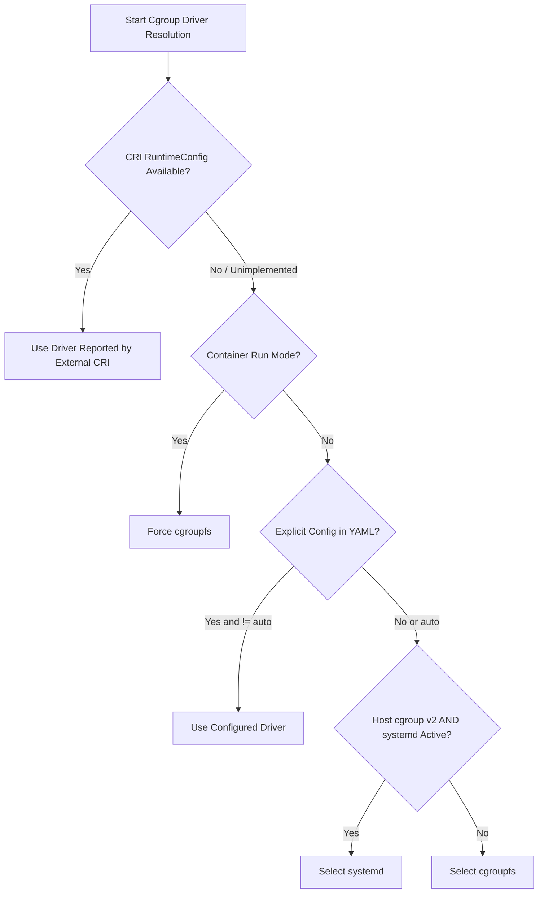

# External Container Runtime Integration Runbook

This runbook details how to integrate Rubix with an externally managed host container runtime,
such as pre-installed containerd or CRI-O, rather than using Rubix's built-in managed containerd.

---

## 1. Managed vs. External Runtime Boundaries

Rubix provides two distinct container runtime modes:

| Feature | Managed Containerd (Default) | External Container Runtime |
| --- | --- | --- |
| **Runtime Process** | Supervised and started by Rubix (`containerd v2.2.5`) | Started and supervised by host init system (systemd, OpenRC) |
| **Configuration** | Owned by Rubix at `/var/lib/kubesolo/containerd/config.toml` | Owned by host (e.g. `/etc/containerd/config.toml` or `/etc/crio/crio.conf`) |
| **Supported Runtimes** | Bundled containerd with crun | containerd (v2.0.2 / v1.7.24+), CRI-O (v1.32.0 / v1.30.0+) |
| **CNI Configuration** | Managed `/var/lib/kubesolo/containerd/cni/conf` | Host `/etc/cni/net.d/` with Rubix-owned `10-bridge.conflist` |
| **Lifecycle & Reset** | Rubix stops, cleans, and rebuilds runtime state on reset | **Host-owned:** Rubix never stops or cleans external runtime processes or host containers |

> [!IMPORTANT]
> **External Runtime Ownership Rule:**
> When external runtime mode is enabled, host-managed daemons, sockets, images, registries, and
> non-Rubix containers remain strictly host-owned. During `rubixctl reset` or `rubixctl uninstall`,
> Rubix cleans only its owned Kubernetes pods, CNI configuration, and PKI; it will **never** stop the
> host runtime daemon or purge host images.

---

## 2. CRI Socket Configuration

To attach Rubix to an external CRI runtime, configure the socket path in `/etc/kubesolo/config.yaml`
or via CLI flags/environment variables.

### Configuration Methods

#### Method A: Configuration YAML (`/etc/kubesolo/config.yaml`)
```yaml
apiVersion: kubesolo.io/v1alpha1
kind: Config
runtime:
  # Path to external CRI socket
  endpoint: "unix:///run/containerd/containerd.sock"
```

#### Method B: Legacy CLI Flag / Environment Variable
```sh
# Via explicit CLI flag
kubesolo --container-runtime-endpoint="unix:///run/crio/crio.sock"

# Via environment variable
export KUBESOLO_CONTAINER_RUNTIME_ENDPOINT="unix:///run/containerd/containerd.sock"
```

### Accepted URI Formats and Validation Rules
Rubix strictly validates the `endpoint` URI:
- **Accepted Formats:**
  - `unix:///path/to/socket.sock` (Standard URI format)
  - `/path/to/socket.sock` (Absolute filesystem path; automatically normalized to `unix://`)
- **Rejected Formats (Fail-Closed):**
  - Network schemes like `tcp://`, `http://`, or `https://` are strictly rejected with an error.
  - Relative paths (e.g. `containerd.sock` or `./run/socket.sock`) are rejected.
  - The root directory (`/` or `unix:///`) is rejected.
  - Empty string (`""`) reverts to the built-in managed containerd runtime.

### Standard External Runtime Sockets

| Runtime | Standard Socket Location | Configuration Value |
| --- | --- | --- |
| **Host containerd** | `/run/containerd/containerd.sock` | `unix:///run/containerd/containerd.sock` |
| **Host CRI-O** | `/run/crio/crio.sock` | `unix:///run/crio/crio.sock` |
| **Docker Engine (cri-dockerd)** | `/run/cri-dockerd.sock` | `unix:///run/cri-dockerd.sock` |

---

## 3. Cgroup Driver Matching and Negotiation

Kubernetes requires that Kubelet and the underlying CRI runtime use identical cgroup drivers.
Mismatches between `systemd` and `cgroupfs` cause container creation failures, resource accounting
panics, or Kubelet startup crashes.

### Automatic Cgroup Driver Negotiation Hierarchy
Rubix negotiates the cgroup driver following this strict order of precedence:



1. **CRI Runtime Query (`RuntimeService.RuntimeConfig`):**
   Rubix sends a `RuntimeConfigRequest` to the CRI socket over gRPC. If the runtime explicitly
   reports `CgroupDriver::Systemd` or `CgroupDriver::Cgroupfs`, Rubix adopts that driver directly.
2. **Container Mode Fallback:**
   If running inside Docker container mode, Rubix defaults to `cgroupfs` (as nested systemd cgroups
   require privileged rootless cgroup delegation).
3. **Explicit Operator Override:**
   If configured via `kubernetes.kubelet.cgroupDriver` (or `--cgroup-driver` flag), Rubix uses the
   explicit setting (`systemd` or `cgroupfs`).
4. **Host Capabilities Detection (Fail-Closed Fallback):**
   If `RuntimeConfig` is unsupported by the external runtime (or returns an empty configuration),
   Rubix inspects host capabilities:
   - Evaluates `/sys/fs/cgroup/cgroup.controllers` (Presence indicates **cgroup v2**).
   - Evaluates `/run/systemd/private` (Presence indicates active **systemd** init).
   - If **both** are true: resolves to `systemd`.
   - If either is false (e.g. cgroup v1 or Alpine/OpenRC host): resolves to `cgroupfs`.

### Aligning Host containerd with systemd Cgroup Driver
If your host runs systemd and cgroup v2, configure host containerd (`/etc/containerd/config.toml`):
```toml
version = 2

[plugins."io.containerd.grpc.v1.cri".containerd.runtimes.runc.options]
  SystemdCgroup = true
```
Restart host containerd:
```sh
sudo systemctl restart containerd
```

### Aligning Host CRI-O with systemd Cgroup Driver
In `/etc/crio/crio.conf` or `/etc/crio/crio.conf.d/00-cgroup-manager.conf`:
```toml
[crio.runtime]
cgroup_manager = "systemd"
```
Restart host CRI-O:
```sh
sudo systemctl restart crio
```

---

## 4. Verification and Troubleshooting

### Step 1: Verify CRI Socket Connectivity
Use `crictl` or `rubixctl` to verify the external runtime responds:
```sh
sudo crictl --runtime-endpoint unix:///run/containerd/containerd.sock info
```

### Step 2: Confirm Kubelet Cgroup Configuration
Check the effective rendered Kubelet configuration:
```sh
rubix-kube --print-config | grep cgroup
```
Or inspect `/var/lib/kubesolo/kubelet/kubelet.yaml`:
```sh
grep cgroupDriver /var/lib/kubesolo/kubelet/kubelet.yaml
```
Output must confirm either:
```yaml
cgroupDriver: systemd
```
or
```yaml
cgroupDriver: cgroupfs
```

### Step 3: Common Failure Diagnostics

| Symptom | Cause | Resolution |
| --- | --- | --- |
| `failed to connect to CRI socket` | External runtime is stopped or socket path is incorrect. | Verify host service is running (`systemctl status containerd`) and permissions on `/run/containerd/containerd.sock`. |
| `misaligned cgroup driver: runtime uses systemd but kubelet configured with cgroupfs` | Host runtime configured for `SystemdCgroup = true` on cgroup v1 host or non-systemd init. | Set `SystemdCgroup = false` in `/etc/containerd/config.toml` or align `/etc/kubesolo/config.yaml`. |
| `unsupported CRI endpoint scheme 'tcp://'` | Attempted remote TCP connection without local Unix socket proxy. | Rubix requires local Unix domain sockets for CRI communications to preserve security boundaries. |
